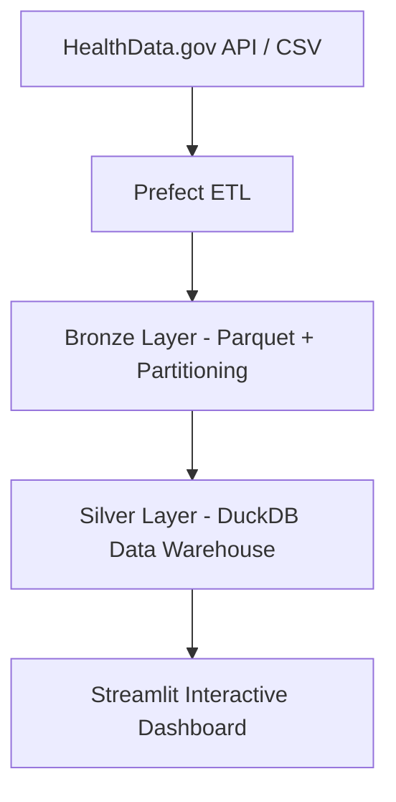

# 🏥 U.S. Hospital Capacity Data Pipeline

**End-to-end data engineering project using real U.S. hospital capacity data from HealthData.gov.
The goal is to build a modern data pipeline (Prefect + Parquet + DuckDB) and expose key healthcare capacity KPIs through a Streamlit dashboard.

This repository demonstrates a modern data pipeline architecture, including automated ingestion, data lake storage, data warehousing for analytics, and an interactive visualization dashboard.

> Built to showcase real-world data skills for U.S.-based data engineering and analytics roles (CPT/F1), using up-to-date technologies aligned with industry demand.

---

## 🔍 Project Overview

This project extracts hospital capacity data from U.S. public health sources, processes it into analytical layers using parquet and DuckDB, and exposes insights via a Streamlit dashboard.

🎯 **Primary goals**

* Collect real healthcare operational data from the U.S.
* Build reproducible and automated data pipelines with Prefect
* Apply good data modeling and governance practices
* Enable data-driven decisions through visualization

📌 **Dataset**

> “COVID-19 Reported Patient Impact and Hospital Capacity by Facility”
> Source: U.S. HealthData.gov (API/CSV)
> [Official dataset link — TODO]

---

## 🧱 Architecture



📌 Layers:

* **Bronze** → Raw data cleaned & standardized (Parquet)
* **Silver** → Analytical warehouse optimized for dashboards (DuckDB)

---

## 🛠️ Tech Stack

| Layer          | Tool                   | Why                                                         |
| -------------- | ---------------------- | ----------------------------------------------------------- |
| Orchestration  | **Prefect**            | Lightweight and modern workflow orchestration               |
| Storage Format | **Parquet / PyArrow**  | Industry standard for analytics and cloud-based data lakes  |
| Query Engine   | **DuckDB**             | Fast OLAP analytics locally; trending in modern data stacks |
| Processing     | **Python** (pandas)    | Most widely adopted language for data engineering           |
| Dashboard      | **Streamlit + Plotly** | Rapid visualization + interactive exploration               |

All tools are free and open-source.
Designed to run locally and be easily extended to cloud environments.

---

## 📊 Current Features

* [ ] Automated dataset ingestion using Prefect
* [ ] Data lake storage in Parquet (Bronze Layer)
* [ ] Data warehouse modeling in DuckDB (Silver Layer)
* [ ] KPIs on hospital capacity and occupancy
* [ ] Streamlit dashboard with filters by state, date, and metrics

📌 Example KPIs:

* Bed occupancy rate over time
* ICU vs non-ICU usage
* Top overloaded hospitals by state

*(screenshots coming soon)*

---

## 📂 Repository Structure

```text
.
├── data/
│   ├── raw/         # Ingested CSV snapshots
│   ├── bronze/      # Parquet files, partitioned
│   └── warehouse/   # DuckDB database file
├── flows/           # Prefect flows for automation
├── src/
│   ├── ingestion/   # Data download scripts
│   ├── transforms/  # Cleaning and DW modeling
│   └── utils/       # Shared helpers
├── dashboards/      # Streamlit web application
├── notebooks/       # EDA and experiments
└── README.md
```

---

## 🚀 How to Run Locally

```bash
# 1️⃣ Install dependencies
pip install -r requirements.txt

# 2️⃣ Run ingestion flow
python -m flows.ingestion_flow

# 3️⃣ Build analytical tables
python -m flows.build_silver_flow

# 4️⃣ Launch dashboard
streamlit run dashboards/app.py
```

---

## 📈 Future Enhancements

* [ ] Add U.S. demographic data to enhance analytics (population context)
* [ ] Incremental ingestion and historical snapshot management
* [ ] Deploy Streamlit app online (Streamlit Cloud)
* [ ] Cloud storage integration (AWS S3 / GCS)
* [ ] Add Brazilian datasets (DATASUS / OpenDataSUS) for international comparison
---

## 👨‍💻 Author

**Pedro Valadão**
Data Engineering & Automation
GitHub: [@pavaladao](https://github.com/pavaladao)

Quer que eu já prepare as **issues do roadmap** para você importar direto no GitHub Projects? Ou quer que eu comece gerando o script da ingestão em Python?
